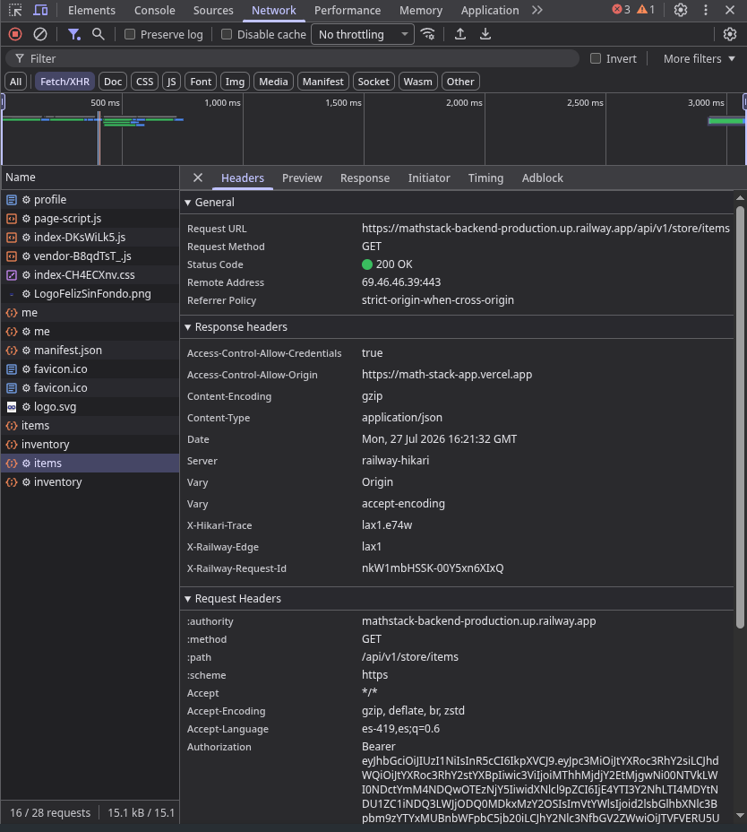
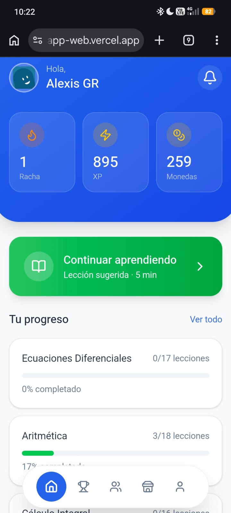

# MathStack - Aplicación del Estudiante

Aplicación frontend principal de **MathStack**, una plataforma interactiva y de gamificación enfocada en el aprendizaje de matemáticas. Construida con **React** y **Vite**, su arquitectura desacoplada permite que toda la comunicación de red fluya hacia un backend central mediante APIs REST. 

El sistema utiliza Contextos Globales y Custom Hooks para manejar flujos complejos como autenticación, estados de progreso y notificaciones.

---

## Arquitectura y Estructura

El proyecto está diseñado bajo un modelo de **Componentes Funcionales** organizados semánticamente:

```
src/
├── app/
│   ├── components/     # Componentes de UI reusables e interactivos (Dashboard, Ejercicios)
│   ├── contexts/       # Estado global (AuthContext, ThemeContext)
│   ├── pages/          # Vistas principales y ruteo
│   └── services/       # Módulo de Red (fetch a API backend, apiClient)
├── lib/                # Funciones utilitarias (cn de Tailwind)
└── main.tsx            # Punto de montaje (React.StrictMode)
```

**Principios utilizados:**
- Separación estricta de la UI (Vistas) y la Lógica de Negocio (Servicios).
- Interfaces de TypeScript estrictamente tipadas para sincronizar el intercambio de datos (*DTOs*) con el backend.

---

## Configuración y Variables de Entorno

Si requieres definir una URL base del backend distinta a la de desarrollo local, configura tu archivo `.env.local` en la raíz de este proyecto:

```env
VITE_API_BASE_URL=http://localhost:8080/api/v1
```

---

## Instrucciones de Instalación y Ejecución

Asegúrate de contar con Node.js (versión 18 o superior).

1. Ingresa a la carpeta: `cd MathStack`
2. Instala las dependencias: `npm install`
3. Arranca el servidor de desarrollo en vivo: `npm run dev`
4. Accede a la interfaz en tu navegador (usualmente en `http://localhost:5173`).
5. Para compilar la versión de producción optimizada: `npm run build`

---

## Consumo de APIs y Servicios (Client)

Este frontend nunca ejecuta lógica de base de datos de manera aislada. Consume las APIs del backend `MathStack-Backend`.
La clase `apiClient.ts` abstrae las operaciones HTTP, añadiendo el `Authorization: Bearer <token>` de forma transparente para las rutas protegidas.

**Ejemplos de consumo principal:**
- `socialService.getChallengeExercises(id)`: Llama a `/api/v1/social/challenges/{id}/exercises` para instanciar ejercicios interactivos (Componente `ChallengeExercise`).
- `userService.updateGamificationStats()`: Tras finalizar una sesión, sincroniza monedas y XP ganadas al backend.

---

## Pruebas y Evidencias (Postman/UI)

-
---

---

## Declaración de Uso de IA y Recursos Externos

**Inteligencia Artificial:** Se emplearon herramientas como Gemini bajo la modalidad de _Pair Programming_ y asistente de IDE. Se usó IA para diseñar componentes de interfaz en Tailwind, refactorizar lógica sincrónica (promesas y efectos de React), y generar soluciones de tipado en TypeScript. Todas las decisiones de estructura de componentes, experiencia de usuario y lógica matemática fueron verificadas y dirigidas por el equipo humano.
**Recursos Externos:** React, Vite, Tailwind CSS, Lucide React (íconos), Framer Motion (animaciones).
